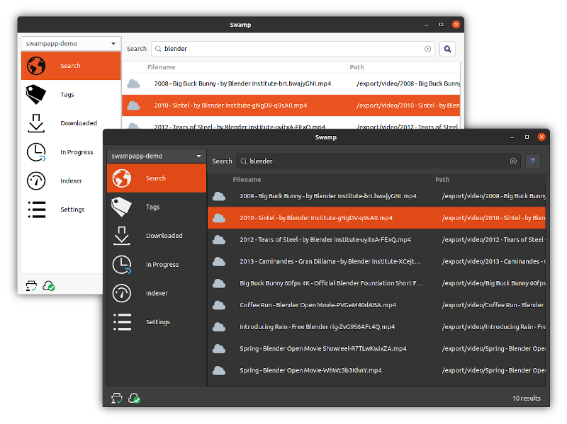
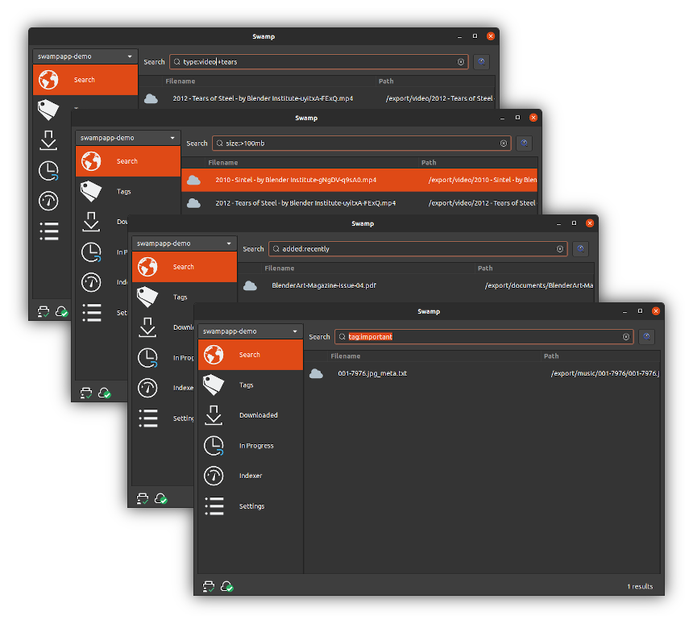
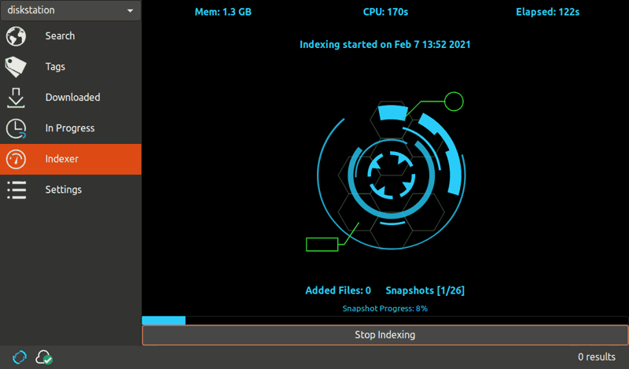
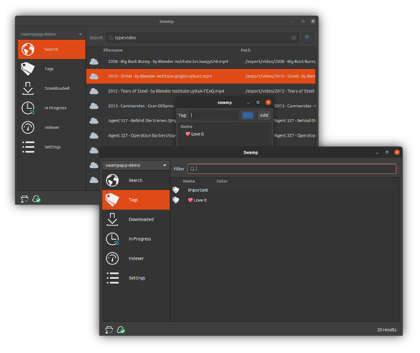
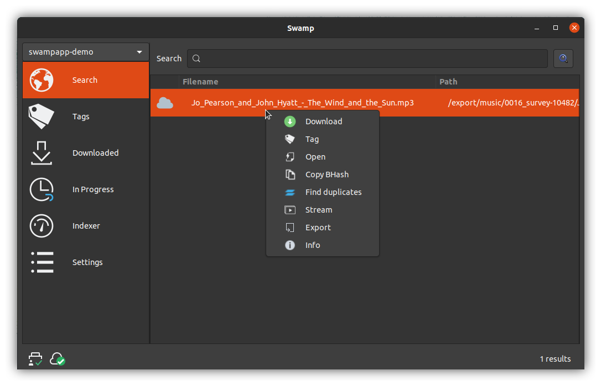
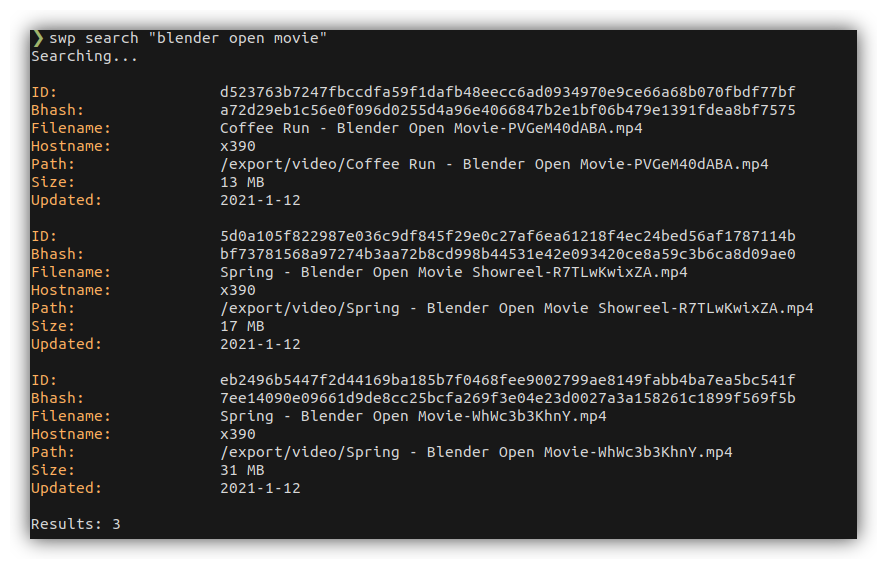

# Swamp

A GNOME application to index, search, stream, download and export files in [Restic](https://restic.net) repositories.

[Quick start guide](docs/quickstart.md).

**⚠️ Currently alpha quality:**

* [Ubuntu Desktop 20.04](https://releases.ubuntu.com/20.04) (with GNOME) is the only environment currently supported
* It may crash often
* It may behave unreliably
* The on-disk data and index format may change before the final release, and data migration isn't guaranteed, forcing you to re-index your repositories eventually
* It may have obvious and important issues that could compromise the safety and security of your data
* Large chunks of the code are still in a PoC state and may lack readability, proper error handling or reporting
* Some functionality is still missing

There's a more comprehensive overview of what's missing for those technically inclined or willing to contribute in the [release plan document](docs/release_plan.md).

## Features

### Read-only

Swamp doesn't write to your Restic repository. It works just fine with read-only repositories.

### Desktop integration

The GNOME keyring is the place where the repository credentials are stored. Other features like [MPRIS](https://specifications.freedesktop.org/mpris-spec/latest/) (to play media files) and [UPower](https://upower.freedesktop.org/) (to prevent the indexing process when on battery) are planed.

Dark/Light themes are also supported.



### Supports any Restic backend

Swamp is powered by [Restic](https://restic.net), meaning that it can index and search S3, Rest Server, local, rclone backends, etc. (Limited to S3, local and rest in the current alpha version)

### Powerful query language

Swamp uses and extends [the Bleve query language](https://blevesearch.com/docs/Query/) to make locating/searching for backed up files easy.



With the query language you can do things like:

* Search for files bigger or smaller than a given size
* Find duplicated files
* Find documents, videos, audio files, etc easily
* Find recently backed up files
* Find recently modified files

And much more. See the  for some additional examples.

### Reasonably fast indexing

Capable of indexing 1000+ files per second in a regular laptop. Polls for new Restic snapshots regularly to index them automatically.



### Tagger

Tag you backed up files to quickly locate them later.



### Multiple repositories

Supports indexing and searching multiple Restic repositories. The author uses Restic repositories as "append-only, deduplicated and encrypted storage servers" (where files are never pruned/deleted) and shares some of those repositories with family members and friends, so Swamp tries to make it easier to search across them (the main motivation behind creating Swamp).

### Stream Download and Export your backed up data

Swamp can stream your video or audio files or download/export any file and version to the desired location.



### Keyboard friendly

Swamp provides quick access to the most important features via keyboard shortcuts.

#### Global shortcuts (from any panel)

* **Ctrl-f:** open the search panel

#### Search panel

* **Ctrl-d:** download selected file(s)
* **Ctrl-s:** stream selected file(s)
* **Ctrl-t:** tag selected file(s)
* **Ctrl-o:** download and open selected file(s)
* **Ctrl-e:** download and export selected file(s)

#### Downloads panel

* **Ctrl-o:** open selected file(s)
* **Ctrl-t:** tag selected file(s)

### Command line interface

Swamp includes a command line interface (`swp`) to query the repositories after being indexed.



## Quick Start Guide

The [quick start guide](docs/quickstart.md) will get you started with swamp. Don't worry, if you already know Restic, this will be a walk in the park.

## Developer resources

### Building from source

**Needs** [Go 1.16](https://golang.org/dl/#unstable), currently in beta.

Install the required dependencies and run `make`:

```
sudo apt install build-essential libgtk-3-dev libcairo2-dev libglib2.0-dev libglib2.0-dev-bin upx
make
```

### Credits

* Awesome logos from [@blackirin](https://github.com/blackirin)
* Animated gifs from [loading.io](https://loading.io)
* Application icons ([Qogir](https://github.com/vinceliuice/Qogir-icon-theme), [Tela](https://github.com/vinceliuice/Tela-icon-theme), [We10x](https://github.com/yeyushengfan258/We10X-icon-theme), [Infinity Lavender](https://www.gnome-look.org/p/1457365), [McMuse](https://github.com/yeyushengfan258/McMuse-icon-theme))
* [Restic](https://github.com/restic/restic) code is used by swamp via [RAPI](https://github.com/rubiojr/rapi)
* [Bluge](https://github.com/blugelabs/bluge) powers repository indexing and search (via [rindex](https://github.com/rubiojr/rindex))
* [Gotk3](https://github.com/gotk3/gotk3) is the graphical toolkit doing the pixel pushing
* [Keyring](https://github.com/zalando/go-keyring) provides access to the GNOME keyring
* A few libraries from the amazing [@muesli](https://github.com/muesli)
* [Zerolog](https://github.com/rs/zerolog) for superb structured logging
* [Go LevelDB](https://github.com/syndtr/goleveldb) to store out-of-the-index bits used by Swamp
* [CLI](https://github.com/urfave/cli), my favorite command line parser
* [Humanize](https://github.com/dustin/go-humanize) makes some numbers easily parseable by humans
